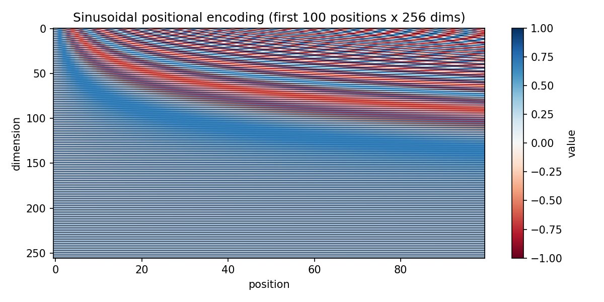
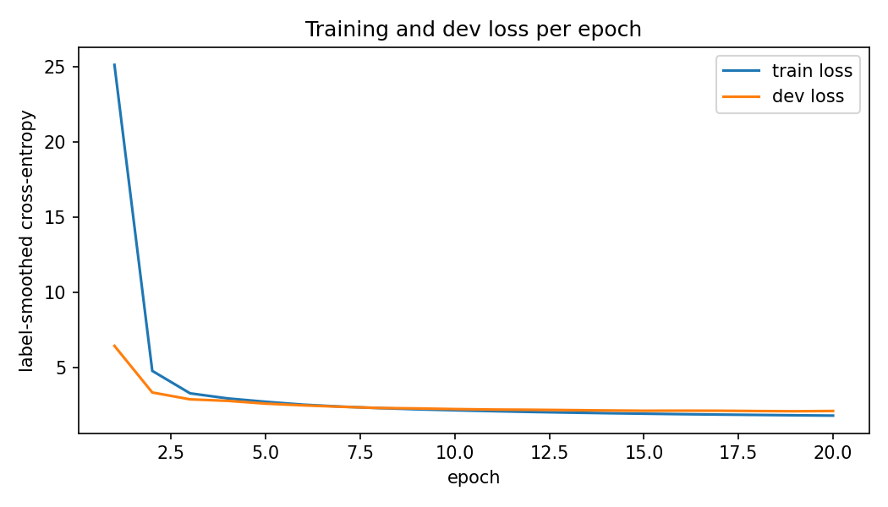
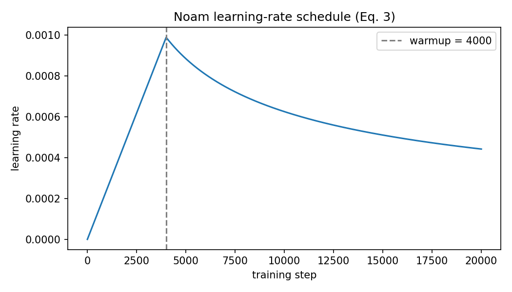
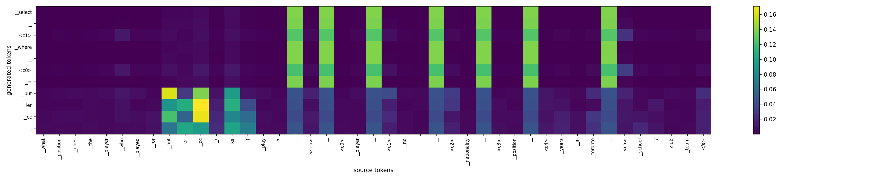

# Text-to-SQL Transformer

An encoder-decoder Transformer, implemented from scratch in PyTorch, that translates natural language questions into SQL — trained on [WikiSQL](https://github.com/salesforce/WikiSQL) (80K+ question/SQL pairs over 24K Wikipedia tables).

```
Question: What school/club team is Amir Johnson on?
Columns:  Player, No., Nationality, Position, Years, School/Club Team
Output:   SELECT School/Club Team FROM table WHERE Player = 'Amir Johnson'
```

## Overview

- Full implementation of ["Attention Is All You Need"](https://arxiv.org/abs/1706.03762) (Vaswani et al., 2017) — scaled dot-product and multi-head attention, sinusoidal positional encoding, post-norm encoder/decoder stacks — built directly from `nn.Linear` / `nn.Embedding` / `nn.LayerNorm` primitives. No `nn.Transformer`, no `nn.MultiheadAttention`, no pretrained weights.
- Trained end-to-end on WikiSQL's 56K training examples with a shared BPE vocabulary, label smoothing, and the original paper's warm-up/decay learning-rate schedule.
- Served through a FastAPI backend and a React front end for interactive querying against the trained model.

## Project structure

```
Text_to_SQL_Transformer.ipynb   data pipeline, model, training, and evaluation
backend/                        FastAPI service that loads the checkpoint and runs inference
frontend/                       React interface for interactive querying
results/                        plots, sample predictions, and evaluation metrics
```

## Architecture

| | |
|---|---|
| Embedding dimension | 256 |
| Attention heads | 4 (64 dim each) |
| Encoder / decoder layers | 3 / 3 |
| Feed-forward dimension | 1024 |
| Dropout | 0.1 |
| Normalization | Post-norm, `LayerNorm(x + Sublayer(x))` |
| Weight sharing | Encoder embedding, decoder embedding, and output projection share one matrix |
| Parameters | 7,577,600 |

Source and target share one 8,000-piece BPE vocabulary. Columns are referred to by position tokens (`<c0>`, `<c1>`, ...) rather than by name, so the model has to learn to *point* at the right column instead of memorizing column names.



## Training

20 epochs on a Tesla T4, Adam with the paper's learning-rate schedule (linear warm-up for 4,000 steps, then inverse-square-root decay), cross-entropy loss with label smoothing.




| | |
|---|---|
| Epochs / best epoch | 20 / 19 |
| Best dev loss | 2.11 |
| Training time | ~22 minutes |

## Results

Evaluated with WikiSQL's own evaluator (never a custom reimplementation).

| Split | Decoding | Logical form | Execution | Parse failures |
|---|---|---|---|---|
| Dev | Greedy | 9.70% | 16.35% | 0.6% |
| Dev | Beam (4) | 10.52% | 17.60% | 0.6% |
| Test | Beam (4) | 9.71% | 17.44% | 0.8% |

| Component (dev) | Accuracy |
|---|---|
| Aggregation | 87.6% |
| Selected column | 30.5% |
| WHERE clause | 23.5% |

As a sanity check on the evaluation pipeline itself: feeding the *gold* SQL back through the same parser and evaluator scores **99.6% execution accuracy** — confirming the data pipeline and metric computation are correct, independent of model quality.

Aggregation is learned reliably, since it follows fixed keyword patterns ("how many" → COUNT) that hold across every table. Column selection is weaker: the cross-attention map below shows why — attention for copying values locks sharply onto the right source tokens, but attention for choosing a column spreads across most of the candidates instead of committing to one.



Ten worked examples (five correct, five wrong, with the failure mode identified for each) are in [`results/samples.md`](results/samples.md).

## Validation

Before trusting the training run, the implementation is checked against a set of behavioral tests, run on random tensors independent of any trained weights:

- **Causal masking** — changing the last token of a decoder input leaves every earlier decoder output unchanged.
- **Padding masking** — appending extra padding to the input leaves the output unchanged; attention weights sum to 1 over the unmasked positions with zero mass on padding.
- **Weight sharing** — the output projection and the embedding table are verified to be the same tensor object, not just numerically equal.
- **Learning-rate schedule** — plotted over 20,000 steps and matches the closed-form warm-up/decay formula.

## Running it

**Train:** open `Text_to_SQL_Transformer.ipynb` in Kaggle or Colab, enable a GPU, and run all cells. It downloads WikiSQL, trains for 20 epochs, evaluates on dev and test, and packages a `results_bundle.zip` with the checkpoint, tokenizer, and metrics.

**Backend:**
```bash
cd backend
python -m venv .venv && .venv\Scripts\activate   # .venv/bin/activate on macOS/Linux
pip install -r requirements.txt
uvicorn server:app --port 8000
```
Expects `best.pt` and `sql_sp.model` from the training run in `results/` — either train it yourself with the notebook, or download them from [Releases](../../releases/tag/v1.0.0) and skip straight to running the app.

**Frontend:**
```bash
cd frontend
npm install
npm run dev
```
Opens on `http://localhost:5173`, calling the backend for live predictions.

## Stack

PyTorch · SentencePiece · FastAPI · React

## References

- Vaswani, A. et al. (2017). [Attention Is All You Need](https://arxiv.org/abs/1706.03762). *NeurIPS 2017*.
- Zhong, V., Xiong, C., & Socher, R. (2017). [Seq2SQL: Generating Structured Queries from Natural Language using Reinforcement Learning](https://arxiv.org/abs/1709.00103). *arXiv:1709.00103*.
- [WikiSQL dataset and official evaluator](https://github.com/salesforce/WikiSQL) — Salesforce Research.
